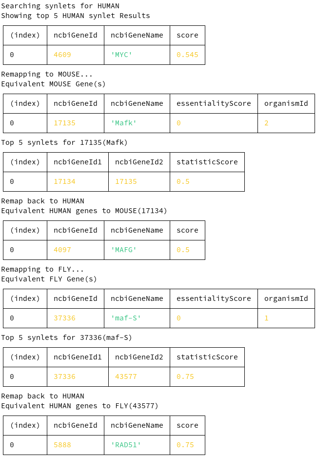

= SynLet DB

== Team
* Abdullah Al-Desoky
* Laurent Mali
* Said Nurćeski
* Julian Schludermann

== Aufgabenstellung
* Es soll eine Datenbank zur Suche von synthetisch lethalen Paaren erstellt werden
* Als input wird ein menschliches Gen gegeben
* Der Output ist eine Liste von synthetisch lethalen Paaren und ein "Score" der Angibt wie erforscht / wirksam das synthetisch lethale Paar ist

== Verwendete Daten
* *CSEGs_CEGs.txt*: https://v3.ogee.info/static/files/CSEGs_CEGs.txt.gz
** Spalten:
*** *gene*: ncbi symbol for the gene
*** *essentiality*: Essentiality score for the given gene
**** *CSEGs*: Cancer-specific essential genes (internally evaluated as score 10%)
**** *CEGs*: Core-essential genes (internally evaluated as score 80%)
*** *ncbi_id*: ncbi_id for the given gene
*** [line-through]#*ensembl*#: unused / irrelevant
** https://www.ncbi.nlm.nih.gov/gene[Ncbi Search]
* *Synthetic lethalities*
** Dateien:
*** *Fly_SL.csv*: https://synlethdb.sist.shanghaitech.edu.cn/static/download/SL/Fly_SL.csv
*** *Human_SL.csv*: https://synlethdb.sist.shanghaitech.edu.cn/static/download/SL/Human_SL.csv
*** *Mouse_SL.csv*: https://synlethdb.sist.shanghaitech.edu.cn/static/download/SL/Mouse_SL.csv
** Spalten:
*** *n1.name*: ncbi name of the first gene
*** *n1.identifier*: ncbi id of the first gene
*** *n2.name*: ncbi name of the second gene
*** *n2.identifier*: ncbi id of the second gene
*** [line-through]#*r.cell_line*#: unused / irrelevant
*** [line-through]#*r.pubmed_id*#: unused / irrelevant
*** [line-through]#*r.source*#: unused / irrelevant
*** *r.statistic_score*: statistic score representing the "quality" of the pair
* *Orthology Files*
** Dateien:
*** *human-2-mouse.txt*: https://omabrowser.org/cgi-bin/gateway.pl?f=PairwiseOrthologs&p1=HUMAN&p2=MOUSE&p3=EntrezGene
*** *human-2-fly.txt*: https://omabrowser.org/cgi-bin/gateway.pl?f=PairwiseOrthologs&p1=HUMAN&p2=DROME&p3=EntrezGene
** Spalten:
*** *1. Spalte*: ncbi_id of human gene
*** *2. Spalte*: ncbi_id of mouse / fly gene
*** [line-through]#3.+4. Spalte#: irrelevant / unused
** Invalid data: Viele spalten enthatlen OMAID's und keine ncbi_id's. Diese Spalten werden beim import in die Datenbank einfach weggeworfen.

== ERD
plantuml::puml/erd.puml[]

=== Create script
[source, sql]
----
include::sql/create-tables.sql[]
----

=== Insert organisms
[source, sql]
----
include::sql/insert-organisms.sql[]
----

== Verwendete Datenbank
Die bei dem Projekt verwendete Datenbank ist *sqlite*.

== Datenbank import
Der Import der Daten in die Datenbank wurde über Typescript-scripts gelöst.

=== Ausführung
Bevor der Datenbank Import ausgeführt werden kann müssen `create-tables.sql` und `insert-organisms.sql` ausgeführt werden. Sobald dies gegeben ist importieren folgende Befehle die Daten aus den CSV Dateien.
[source, bash]
----
cd scripts/csv-importer
npm i # Wird nur benötigt bei erstmaligem Ausführen
npm start
----

=== Ungültige Daten
Jene Daten die nicht dem erwarteten Format folgen, werden beim Einfügen ignoriert und als warning auf die Konsole ausgegeben.

== SynLet Suche
Die SynLet suche wurde über ein Typescript Programm gelöst.
Die Suche nach synthetisch lethalen Paaren läuft grob wiefolgt ab:

* Input des Menschengens
* Suche nach SynLets beim Menschen
** Berechnung des Scores je SynLet
*** Formel: `(1 - essentialityInput) * (1 -  essentialitySynLet) * scoreSynLet`
** Menschen SynLets ausgeben
* Für jeden anderen Organismus
** Input Menschengen auf Organismusgene umwandeln
** Finden von SynLets für jedes der Organismusgene
** SynLet Gene umwandeln auf Menschengene
*** Berechnung von Scores
** Menschengene ausgeben

Die Beschreibung oberhalb ist eine Vereinfachung des wirklichen Ablaufs. Es werden dazwischen noch einige Informationen zu den zwischenergebnissen ausgegeben.

=== Ausführen der Suche
[source, bash]
----
cd scripts/synlet-search
npm i # Wird nur benötigt bei erstmaligem Ausführen
npm start <human gene id>
----

=== "Gute" Testbeispiele
==== Definition von gut
* Menschengen kann zu Maus- und Fliegengenen zugeordnet werden
* Maus- und Fliegengene müssen syntethisch lethale Paare besitzen

==== SQL request zum Finden von guten Testbeispielen
[source, sql]
----
include::sql/test-query.sql[]
----
Diese SQL Abfrage ist relativ langsam, aber nach einigen Minuten erhält man folgende Ergebnisse (ncbi_ids):

* 203
* 1856
* 1857
* 2067
* 2475
* 4361
* 5347
* 5594
* 5599
* 5879
* 5888
* 7975
* 8318
* 10054
* 11200

Aufgrund der Menge können die Ids manuell ausprobiert werden. Die ncbi_id mit dem längsten Output ist `5888`. Natürlich ist diese ID nicht DIE beste und deckt auch nicht alle Testfälle ab. Allerdings können einige (auch etwas komplexere) Auswertung von Zusammenhängen damit überprüft werden.

Ein kleines Testbeispiel ist hingegen `7975`. Der Output dafür wäre (wird auf die nächste Seite geschoben...):

